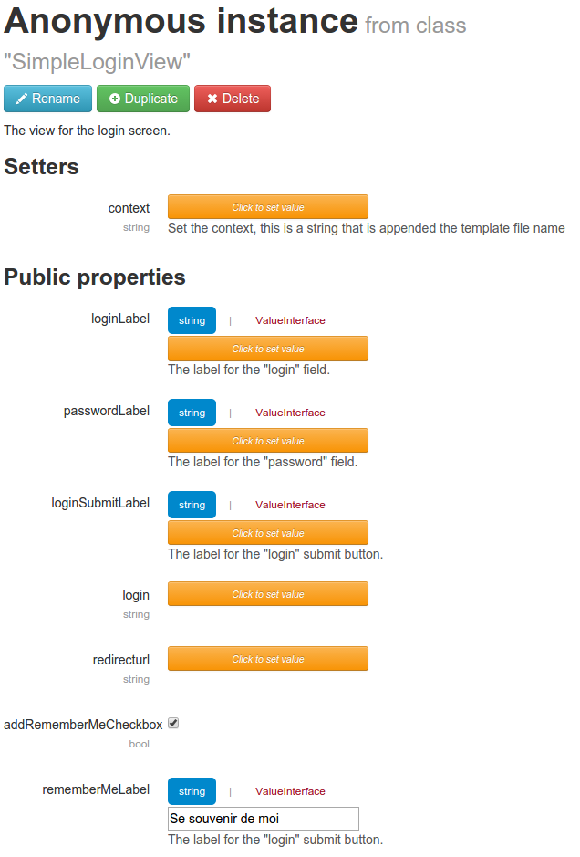

Intergrate the *UserService.RememberMe* feature
------------------------------------

Branch 2.1+ of the [UserService](http://mouf-php.com/packages/mouf/security.userservice/README.md) provide a cookie based remember me feature.

To plug it to your SimpleLoginController you just have to edit your `SimpleLoginView` instance, and set the `$addRememberMeCheckbox` property to 'true', and optionally provide a `$rememberMeLabel` :

Note : Keep in mind that you have to configure the "Rememer Me" feature in the userService : [UserService - Activate the **Remember Me** feature (through cookie)](http://mouf-php.com/packages/mouf/security.userservice/doc/remember_me.md)